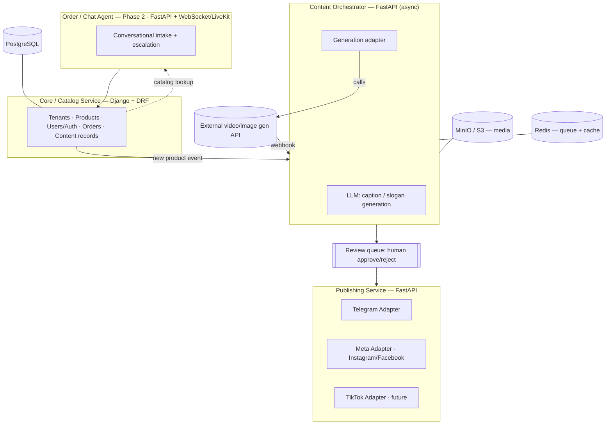
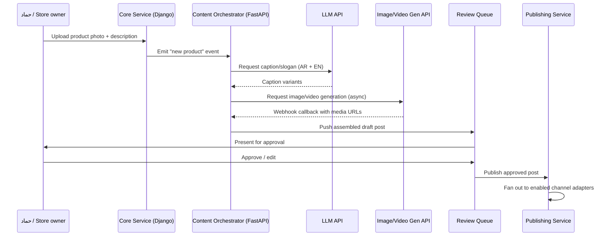

# Beta_store

**An AI-driven media, commerce, and publishing backend for small retail brands.**

Beta_store turns a single product photo and a short description into a ready-to-publish social media post — image, slogan, and short video — and auto-publishes it across channels. A later phase adds an AI chat/voice agent for order intake. Pilot brand: **حمادة عزو (Hammada Azzo)**, a boutique selling accessories and makeup.

> [!NOTE]
> This repository currently documents the **system design and evaluation phase**. No application code has been written yet — see [Roadmap](#roadmap) for what ships first.

---

## Quick Facts

| |                                                                         |
|---|-------------------------------------------------------------------------|
| **Pilot brand** | Beta_store — accessories & makeup boutique                |
| **Core stack** | Django REST Framework, FastAPI, PostgreSQL, Redis, Docker Compose, Nginx |
| **Launch channel** | Telegram (open API, no review gate)                                     |
| **Current phase** | 0 — internal tool, design & architecture                                |
| **Tenancy model** | Single-tenant now, multi-tenant-ready design                            |

## Table of Contents

- [Overview](#overview)
- [Problem & Motivation](#problem--motivation)
- [Core Features](#core-features)
- [System Architecture](#system-architecture)
- [Data Flow](#data-flow)
- [Tech Stack](#tech-stack)
- [Channel Rollout & Platform Risk](#channel-rollout--platform-risk)
- [Evaluation](#evaluation)
- [Roadmap](#roadmap)
- [Design Opinion & Recommendations](#design-opinion--recommendations)
- [References](#references)

---

## Overview

Beta_store is really three coupled capabilities sharing one backend:

| # | Capability | What it does |
|---|---|---|
| 1 | **Generative content pipeline** | Product photo + description → AI-generated post (image + slogan) + short video → auto-published to social media and Telegram. |
| 2 | **Conversational commerce layer** | A chat/voice agent that takes customer orders and filters/qualifies them before human handoff. |
| 3 | **Backend platform** | Django REST Framework + FastAPI microservices underneath both, designed for system-design rigor rather than a quick script. |

<strong>Original project brief (as written)</strong>

> To be the media front of the company/store publicity; an AI agent that takes orders, filters, and chat bots that communicate with clients, embedded in the app. The core idea: upload a product image with a description, AI agents process it and produce an attractive post with a slogan and a video, published to social media and Telegram. Focused on a strong backend with Django and FastAPI, microservices architecture, full system design, evaluation, and enhancement roadmap.

## Problem & Motivation

Small retail brands in Egypt and the Gulf typically have:

- ✅ Product photos and short descriptions
- ✅ An existing Telegram/social following
- ❌ No videographer or in-house marketing team
- ❌ No time to manually design a post for every new product

Beta_store's core bet: the "photo in → ad out" step can be **fully automated using existing generative APIs**, orchestrated reliably — rather than requiring custom AI model training.

## Core Features

| Feature | Status | Description |
|---|---|---|
| 🖼️ Photo → Post generation | Planned (Phase 0–1) | Product image + description in; captioned image + short video out. |
| 📡 Multi-channel publishing | Planned (Phase 1–2) | Auto-publish to Telegram first, then Instagram/Facebook. |
| ✅ Review/approval queue | Planned (Phase 1) | Human approves or edits a generated post before it goes live. |
| 💬 AI order-taking agent | Planned (Phase 3) | Chat, later voice, intake for customer orders with human escalation. |
| 🏢 Multi-tenant ready | Design consideration | Single-tenant first; schema/auth designed so multi-tenancy is a migration, not a rewrite. |

## System Architecture

<strong>Service responsibilities (table view)</strong>

| Service | Framework | Responsibility |
|---|---|---|
| **Core / Catalog service** | Django + DRF | Source of truth: tenants, products, catalog, users/auth, orders, content records, approval state (PostgreSQL-backed). |
| **Content Orchestrator** | FastAPI (async) | Coordinates the generation pipeline: LLM captioning, calls to the generation adapter, assembling drafts, pushing to the review queue. |
| **Generation adapter(s)** | Thin FastAPI wrapper | Isolates the actual creative vendor (image/video generation API) behind one internal interface. |
| **Publishing service** | FastAPI | One adapter per channel (Telegram, Meta, future TikTok), each implementing a common `publish(post) -> status` interface. |
| **Order/Chat agent** *(phase 2)* | FastAPI + WebSocket (+ LiveKit for voice) | Conversational order intake, cart/product lookup against the Core service, human escalation. |
| **Media storage** | MinIO/S3 | Product photos, generated images/video. |
| **Cache/queue** | Redis | Task queue (Streams or Celery broker) + caching. |
| **Reverse proxy** | Nginx | Routing, TLS, rate-limiting inbound webhooks. |

## Data Flow

## Tech Stack

| Layer | Technology |
|---|---|
| **Backend frameworks** | Django REST Framework, FastAPI |
| **Database** | PostgreSQL |
| **Cache / task queue** | Redis (Streams or Celery broker) |
| **Object storage** | MinIO / S3 (media: photos, generated images, video) |
| **Infra** | Docker Compose, Nginx |
| **AI — copywriting** | LLM API, e.g. Groq/Llama-3 |
| **AI — image/video generation** | External product-image-to-video API, e.g. [Creatify `product_to_videos`](https://docs.creatify.ai/api-documentation/product-to-video/product-to-video) |
| **AI — voice (phase 3)** | LiveKit + Deepgram for order-agent voice intake |
| **Channels** | Telegram Bot API (v1) → Meta Graph API (v2) → TikTok (future) |

## Channel Rollout & Platform Risk

| Channel | Access model | Risk / gate | Rollout phase |
|---|---|---|---|
| **Telegram** | Open Bot API | None — no review process | Phase 1 (launch channel) |
| **Instagram / Facebook** | Meta Graph API | Requires Business/Creator account + Page link; **Meta App Review required** before publishing beyond test accounts | Phase 2 |
| **TikTok** | Content Posting API | Most restrictive of the three | Future / opportunistic |

> [!IMPORTANT]
> In a multi-tenant future, **every tenant's Meta account** effectively needs to pass through Meta's review/consent flow individually — this is a business-process dependency, not just an engineering one. Budget real time for it before promising "auto-publish everywhere."

> [!TIP]
> The generation step (image/video creation) is **API orchestration, not model training** — this significantly lowers the ML burden, but introduces a per-generation API cost and latency that should be priced into any per-post or per-tenant plan.

## Evaluation

| Dimension | Rating | Notes |
|---|:---:|---|
| Technical feasibility | ⭐⭐⭐⭐⭐ | Every component exists today and fits the existing stack. |
| Market validation | ⭐⭐⭐⭐☆ | A real pilot brand (حمادة عزو) already exists — above average for a portfolio project. |
| Team/execution risk | ⭐⭐☆☆☆ | Main risk — solo build spanning three product domains at once. |
| Platform/regulatory risk | ⭐⭐☆☆☆ | Meta App Review and TikTok restrictions gate full multi-channel auto-publishing. |
| Cost model | ⭐⭐☆☆☆ | Not yet modeled — each generated asset is a paid API call. |

## Roadmap

- [ ] **Phase 0 — Internal tool.** Manual-trigger content pipeline (Django admin) for حمادة عزو: upload → caption + video → review → publish.
- [ ] **Phase 1 — Telegram MVP.** Automated pipeline with review queue, publishing to Telegram only.
- [ ] **Phase 2 — Meta channel.** Add Instagram/Facebook once one real business account has passed Meta App Review.
- [ ] **Phase 3 — Order agent.** Add the AI chat/voice order-intake agent, reusing LiveKit/Deepgram/Groq patterns.
- [ ] **Phase 4 — Multi-tenant SaaS.** Generalize to multiple stores, if/when the single-tenant version has proven out.

## Design Opinion & Recommendations

> **TL;DR** — The idea is sound and better validated than most portfolio projects: it has a real pilot business behind it and maps directly onto an existing, proven microservices stack. The main risk is scope, not technology.

1. Ship the content pipeline alone first (Telegram-only, human-reviewed).
2. Add Meta publishing only once a real account has cleared App Review.
3. Treat the order-taking agent as a distinct Phase 3, not a parallel track.
4. Build the publishing layer as pluggable channel adapters from day one — platform APIs and restrictions change over time.
5. Decide single-tenant vs. multi-tenant scope explicitly before designing the auth/permissions model.

## References

- [Instagram Graph API: Complete Developer Guide for 2026 — Netrows](https://www.netrows.com/blog/instagram-graph-api-guide-2026)
- [Instagram Posting API: The 2026 Integration Guide — Blotato](https://www.blotato.com/blog/instagram-posting-api)
- [Creatify — Product to Video API docs](https://docs.creatify.ai/api-documentation/product-to-video/product-to-video)
- [Creatify — 6 Most Powerful AI Video Generation APIs in 2026](https://creatify.ai/blog/most-powerful-ai-video-generation-apis)
- [HeyGen API Guide: 6 APIs for AI Video and Voice Creation](https://www.heygen.com/blog/heygen-api-guide)

---

Maintained by حماد (Hammad) — backend & AI integration engineer.